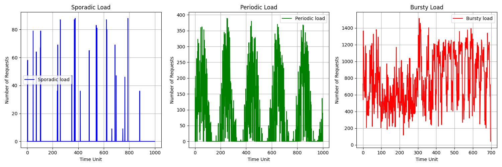
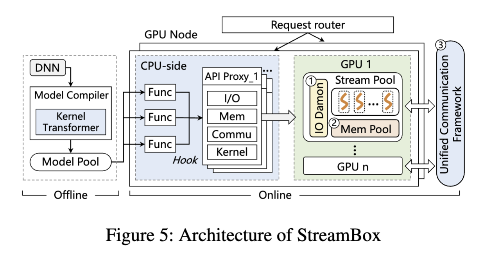

# streambox
## Table of Contents

  
- [streambox](#streambox)
  - [Table of Contents](#table-of-contents)
  - [Introduction](#introduction)
  - [Architecture](#architecture)
    - [Model Compiler](#model-compiler)
      - [Model Transformation](#model-transformation)
      - [Code Modification](#code-modification)
      - [Compile the modified code into Pytorch](#compile-the-modified-code-into-pytorch)
    - [Guest Library](#guest-library)
      - [Hook CUDA Runtime API](#hook-cuda-runtime-api)
      - [Transfer API to API Proxy](#transfer-api-to-api-proxy)
    - [API Proxy](#api-proxy)
      - [stream manager](#stream-manager)
      - [event manager](#event-manager)
      - [IO manager](#io-manager)
      - [mempool manager](#mempool-manager)
      - [kernel manager](#kernel-manager)
      - [communication manager](#communication-manager)
  - [Experiment](#experiment)
    - [Hardware Requirement](#hardware-requirement)
    - [Software Requirement](#software-requirement)
    - [Run experiment](#run-experiment)

## Introduction

**StreamBox is a novel lightweight GPU sandbox of serverless inference.** Existing serverless inference system normally isolate functions in seperate monolithic GPU runtime, which leads to high startup delay, large memory footprint, and expensive data movement. StreamBox serves functions in different **streams** of the same gpu runtime, avoids rundant memory usage, substantially reduce the start delay. Besides, StreamBox further design fast concurrent I/O, fine-grained memory pool and unified intra-GPU communication framework. In our evaluation, serverless services are invoked by dynamic invocations simulated using the production trace from [Azure function](https://azure.microsoft.com/en-us/products/functions/), which includes 7-day request statistics with diurnal and weekly patterns. There are three typical types of production traces: sporadic, periodic, and bursty. The workload is shown in the figure below. Compared to prior state-of-the-art, StreamBox reduce GPU memory footprint up to **8X**, improve throughput by **2.2X**. 

 

## Architecture
It can be simply considered that StreamBox consists of three parts: **model compiler, Guest Library, and API Dameon.** Given the function code inference models, model compiler transforms the source code of the models to customized kenrels and compile the kernels into Pytorch operators offline. When Requests come, the guest library intercepts all API calss, and forwards them to API Dameon. API Dameon actually uses GPU, it manages and forwards APIs received to different streams following designed policys. The details of the three components are as follows

### Model Compiler
Given the function code of inference models, model compiler first transforms the models(`.py` file) into `.cu` file, then modifies the code, and finally compile the kernels into Pytorch operators.
#### Model Transformation
[TVM](https://tvm.apache.org/) is an open source machine learning compiler framework for CPUs, GPUs, and machine learning accelerators. Using TVM, StreamBox transforms the code of the `.py` file into the code of the `.cu` file. Take [resnet18.py](./tvm/model/resnet18.py) as an example, based on the features(e.g., batchsize) extracted from `.py` files , StreamBox generates one `.cu` file(including all kernels), two `.json` file(records the relationship between variables and kernels) and one `.params` file(model parameters). The code of  `.cu` file will be modified then and other files will be sent to API Proxy for further use.

    from tvm import relay
    from tvm.relay import testing
    import tvm
    from tvm import te
    from tvm.contrib import graph_runtime
    ...
    device_source_file = open("resnet18s16/"+sys.argv[1], "w")  # cu
    raw_schedule_file = open("resnet18s16/"+sys.argv[2], "w")  # json
    graph_json_file = open("resnet18s16/"+sys.argv[3], "w")  # json
    param_file = open("resnet18s16/"+sys.argv[4], "w+b")  # params

    batch_size = 16
    num_class = 1000
    image_shape = (3, 224, 224)
    data_shape = (batch_size,) + image_shape
    out_shape = (batch_size, num_class)
    ...
#### Code Modification
To enable **GPU partition** on each kerenl, StreamBox modifies each kernel. As the code example below, StreamBox adds the parameter `available_sm` to each kernel. `Available_sm` is an array that records which sms are available, it will be initialized when the requests come. For the sm with id i, if it is available, set `available_sm`\[i\] 1 while other elements in the array are set 0. At the start of each kernel, every thread gets the allocated sm and judges whether this sm is availavle, if not, kernel simply returns. 
    
    extern "C" __device__ uint get_smid(void) {
    uint ret;
    asm("mov.u32 %0, %smid;" : "=r"(ret) );
    return ret;
    }
    ...

    extern "C" __global__ void fused_add_nn_relu_2_kernel0(int* __restrict__ available_sm,int* gtask,int* orgridsize,float* __restrict__ T_relu, float* __restrict__ placeholder, float* __restrict__ placeholder1) {
    int smid;
    int sm_flag;
    //block offset, same for all the threads
    __shared__ int basicoffset;
    basicoffset=-1;
    int offset=0;
    
    if(threadIdx.x+threadIdx.y+threadIdx.z == 0)
    {
       //get smid
       smid = get_smid();
       //judge whether sm with id smid can be used, if available_sm[smid]==1, yes.
       if (atomicAdd(&sm_flag, 1) == 2) 
       {
       //get virtual block number
       basicoffset=atomicAdd(gtask+0,1);
       }
    } 
    __syncthreads();

    offset = basicoffset;
    while(offset<orgridsize[0]*orgridsize[1]*orgridsize[2]&&offset>=0) {
       __syncthreads();
       //use vx, vy, vz to replace blockIdx.x, blockIdx.y, blockIdx.y
       int vx = (offset)/(orgridsize[1]*orgridsize[2]);
       int vy = (offset - (vx * orgridsize[1]*orgridsize[2])) / orgridsize[2];
       int vz = offset - (vx * orgridsize[1]*orgridsize[2]) - vy *orgridsize[2];
    
       //The following is the original code
       ...

       //update virtual block number
       if(threadIdx.x+threadIdx.y+threadIdx.z == 0)
       {
         basicoffset=atomicAdd(gtask+0,1);
       }      
       __syncthreads();
       offset = basicoffset;
    }

    }
#### Compile the modified code into Pytorch
To make use of the modified kernels in Pytorch, the modified code should be compiled into Pytorch. This process follows the tutorial [Custom C++ and CUDA Extensions](https://pytorch.org/tutorials/advanced/cpp_extension.html#custom-c-and-cuda-extensions). First, create **C Wrapper** to provide an interface that PyTorch can call. The example code is as follows.

    void torch_fused_add_nn_relu_2_kernel0(torch::Tensor &available_sm, 
    torch::Tensor &T_relu, 
    torch::Tensor &placeholder,
    torch::Tensor &placeholder1) { 
    fused_add_nn_relu_2_kernel0((int *)available_sm.data_ptr(), 
    (float *)T_relu.data_ptr(), 
    (float *)placeholder.data_ptr(); 
    (float *)placeholder1.data_ptr()); 
    } 

    PYBIND11_MODULE(TORCH_EXTENSION_NAME, m) { 
      m.def("torch_fused_add_nn_relu_2_kernel0", 
      &torch_fused_add_nn_relu_2_kernel0, 
      "torch_fused_add_nn_relu_2_kernel0"); 
    }

Then, through **setup tools**, compile the kernels into pytorch. The example code(setup.py) is as follows. 

    from setuptools import setup 
    from torch.utils.cpp_extension import BuildExtension, CUDAExtension 
    
    setup( 
      name="fused_add_nn_relu_2_kernel0", 
      include_dirs=["include"], 
      ext_modules=[ 
        CUDAExtension( 
          "add2", 
          ["kernel/fused_add_nn_relu_2_kernel0.cpp", "kernel/fused_add_nn_relu_2_kernel0.cu"], ) 
        ], 
        cmdclass={ 
          "build_ext": BuildExtension 
          } 
    )
Run the command below, and then the CUDA extension StreamBox offered can be used in Pytorch.

    python3 setup.py install

### Guest Library
Guest library is inserted to interpose and intercept every API call which, through IPC, are forwarded to API Proxy.
#### Hook CUDA Runtime API
Firstly, we write the `lib.cpp` library to hook CUDA Runtime API, in which we implement the hook process for each process (or container). [Example](./example/cudahook/)

The compile command will be like this:
  ```bash
  g++ -I/usr/local/cuda/include -fPIC -shared -o libmylib.so mylib.cpp -ldl -L/usr/local/cuda/lib64 -lcudart
  ```
* `-I/usr/local/cuda/include`: The `-I` option is used to specify the directory where the compiler can find the header files. In this case, it'sthe path of CUDA header files.
* `-fPIC` is used to generate position-independent code.
* `-shared` is used to generate a shared object.
* `-o libmylib.so` is the name of the shared object.
* `mylib.cpp` is the source file.
* `-ldl` is used to link the dynamic library.
* `-L/usr/local/cuda/lib64`: The `-L` option specifies the directory where the compiler can find the library files. In this case, it's the path of CUDA dynamic library.
* `-lcudart` is the name of CUDA dynamic library.
#### Transfer API to API Proxy
All the hooked api will be transferred to API Proxy through IPC. In our experiment, we use **Unix Domain Socket** to transfer the API Locally, which provides higher performance than other IPC methods when local communication is needed.
### API Proxy
API Proxy manages all the received APS calls and forwards them to GPU at the right time. Depending on the type of APIs responsible, **API Proxy consists of Six components: stream manager, evnet manager, io manager, mempool manager, kernel manager and communication manager.** For each component, creating a thread to be responsible for calling Related APIs. After the API Proxy process starts running, it receives all the APIs and forwards them to different components based on the type of the API. Each component interacts through global variables. The detailed design of different components is as follows.
#### stream manager
**Streammanager is responsible for creating, destroying and allocating streams.** When the stream thread starts, it call `cuStreamCreate` to precreate many streams(which make up a stream pool) for further use. When requests come and call for new streams, streammanager directly assign streams from the stream pool(instead of creating new one). Also, streammanager marks streams as unused instaed of destroying them. The relationship between each function and its streams are reocrded in a map table.
#### event manager
**Event manager is responsible for inserting events to achieve synchronization between differnet streams.** Its work is based on the json file obtained from [model transformation](#model-transformation) and APIs received. For example, before launching kernel, parameters should be copied to gpu first. To achieve this, eventmanager inserts event to io stream after each `cuMemcpyAsync` call and call `cuEventRecord`, `cuStreamWaitEvent` to make the kernel stream wait until the io task fininshes.
#### IO manager
**IO manager is responsible for calling `cuMemcpyAsync` to copy the input, model and output between cpu to gpu.** IO manager creates a function queue for each function and stores the metadata (i.e., source address and destination address) in their function queue.Next, the data are divided into fixed size blocks and the metadata of these blocks are stored in a global device queue (default is round-robin). Newly arrived requests join the device queue through Preemption Module. Then IOmanager fetches data blocks according to the device queue and triggers the transfer of data blocks in turn.
#### mempool manager
**Mempool manager is responsible for adjusting the size of the mem pool, memory allocation and deallocation.** When the mempool thread starts, it precrate a `CUmemoryPool` for further use. Mempool manager call `cuMemPoolSetAttribute` and set `CU_MEMPOOL_ATTR_RELEASE_THRESHOLD` to adjust the size of mem pool. Based on Fine-grained Management, Mempool manager lazily extend the mempool and eagerly reduce mempool's size. All memory allocation APIs and memory free APIS are replaced by `cuMemAllocAsync` and `cuMemFreeAsync` to make use of mempool.
#### kernel manager
**Kernel manager is responsible for launching kernels.** When requests come, kernel manager first confirms the sms available and records the information in arrays. Kernel manager call `cuModuleLoad` to load modules, `cuModuleGetFunction` to get kernel handle and `cuLaunchKernel` to launch kernels.
#### communication manager
**Comunication manager is responsible for transfering intermediate data between different functions.** When the communication thread starts, it creates a Global key-data table, which is used to record the location of each intermidiate data. The intermediate
data is transferred using PUT and GET APIs. Communication manager first allocates a globally unique index for each intermediate data, and then pass the index to subsequent function. The PUT API records the index and the physical address
of the data in global table in CPU memory. When another function use GET API to access a data with specific index, the corresponding communication mechanism is chosen based on the locations of function and intermediate data.

There are three communication mechanisms according to the distribution of functions in GPU cluster: 1) Functions (i.e., streams) running in the same GPU can share addresses directly, enabling the fastest intermediate data transfer. 2) Functions on
different GPUs can utilize the point-to-point (P2P) mechanism through high-speed NVLink to transfer data. 3) For functions on different nodes, Remote Procedure Call (RPC) is used.


## Experiment
### Hardware Requirement

In our experiment setup, we use a GPU server that consists of two Intel Xeon(R) Gold 5117 CPU (total 28 cores), 128GB of DRAM, and four NVIDIA V100 GPU
(80 CUs and 16GB of memory).

### Software Requirement
* [Docker](https://docs.docker.com/engine/install/ubuntu/)
* [Python3](https://www.python.org/downloads/)
* [Golang](https://go.dev/doc/install)
* [CUDA Driver](https://developer.nvidia.com/cuda-downloads)
* [CUDA Toolkit](https://developer.nvidia.com/cuda-toolkit-archive)
* [Pytorch](https://pytorch.org/get-started/locally/)
* [TensorFlow](https://www.tensorflow.org/install/pip)
* [TVM](https://tvm.apache.org/docs/install/from_source.html)

### Run experiment
Our experiment details are in [experiment/README.md](./experiment/README.md).